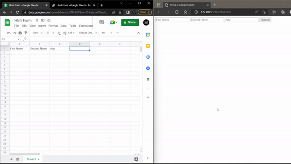

## HTML + JavaScript x Google Sheets

<br/>
Send Html form data to [Google Sheets](#instructions) or [Excel](#html-to-excel)

We have included html file and javascript only file to this github



[Html File](html.html)

[Only JavaScript](javascriptonly.js)

[Google App Script](GoogleAppScript.gs)

##### Html to Excel

> _Note_: You can refer my [blog post](https://docs.sanayvarghese.tk) for syncing data from Google sheet to Excel.

## Instructions

> _Note_: If you need video explanation go to my [blog post](https://docs.sanayvarghese.tk)

<br/>

```
Step 1: Create A Google Sheet and give it a Name
```

```
Step 2: Add Headers to the Google Sheet
```

> _Warning_ : You must make sure your input element name attribute's value must match with the Google Sheet Header

```
Step 3: Go to Extensions . Click on AppScript
```

```
Step 4: Give a Name to AppScript
```

```
Step 5: Replace the default code from "Code.gs" file to the code from 'GoogleAppScript.gs' That i have provided in github
```

```
Step 6: Click on Deploy - New Deployement
```

```
Step 7: Click on settings icon from select type, and choose Web app
```

```
Step 8: Give a description and change only myself to anyone
```

```
Step 9: Click on Deploy
```

> _Note_: If you haven't autorized yet click on Authorize access and select your gmail account then click on advance and click on "go to \<your script name> (unsafe)"

> _Warning_: It is showing unsafe because you selected Anyone. _It's Safe_

```
Step 10: Copy the url and paste it into the html file's variable called googleAppScriptUrl
```

```
Step 11: Go back to Google AppScript Select initalSetup from top and click on Run
```

```
Step 10: Now Everthing is Ready !! Send Data from the html form to Google Sheets
```

If you have any doubt about the setup you can refer our video tutorial in [blog post](https://docs.sanayvarghese.tk) or send a email to helloto.sanay@gmail.com

<br/>

---

### JavaScript

```javascript
// Get Form by its id
const form = document.getElementById("google-form");

// App Script url
const googleAppScriptUrl = "<Enter your App Script Deployed Url>";

// Fuction to send data to google form when submit button is clicked
form.addEventListener("submit", (e) => {
  e.preventDefault();
  try {
    fetch(googleAppScriptUrl, {
      method: "POST",
      mode: "no-cors",
      body: new FormData(form),
    }).then(() => {
      // Do someting After successfull submission
      console.log("success");
    });
  } catch (error) {
    // Do something for the error case
    console.log(error);
  }
});
```

---

### App Script

```javascript
const sheetName = "Sheet1";
const scriptProp = PropertiesService.getScriptProperties();

function initialSetup() {
  const activeSpreadsheet = SpreadsheetApp.getActiveSpreadsheet();
  scriptProp.setProperty("key", activeSpreadsheet.getId());
}

function doPost(e) {
  const lock = LockService.getScriptLock();
  lock.tryLock(10000);

  try {
    const doc = SpreadsheetApp.openById(scriptProp.getProperty("key"));
    const sheet = doc.getSheetByName(sheetName);

    const headers = sheet
      .getRange(1, 1, 1, sheet.getLastColumn())
      .getValues()[0];
    const nextRow = sheet.getLastRow() + 1;

    const newRow = headers.map(function (header) {
      return header === "Date" ? new Date() : e.parameter[header];
    });

    sheet.getRange(nextRow, 1, 1, newRow.length).setValues([newRow]);

    return ContentService.createTextOutput(
      JSON.stringify({ result: "success", row: nextRow })
    ).setMimeType(ContentService.MimeType.JSON);
  } catch (e) {
    return ContentService.createTextOutput(
      JSON.stringify({ result: "error", error: e })
    ).setMimeType(ContentService.MimeType.JSON);
  } finally {
    lock.releaseLock();
  }
}
```

---
